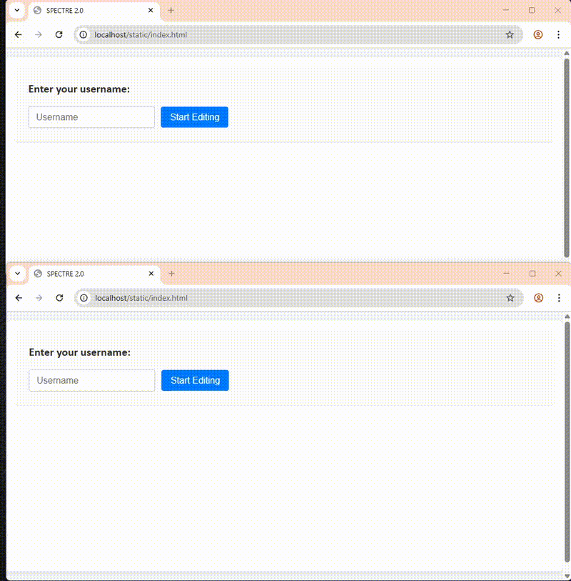

# 🕵️‍♂️ SPECTRE — Real-Time Collaborative Document Editor with Version Control
SPECTRE (Software Problem Evaluation, Collection, Tracking, and Reporting Environment) is a web-based collaborative document editor built for speed, structure, and real-time performance. It fuses modern frontend UX with robust backend design to handle complex, nested document structures — with block-level versioning and live WebSocket collaboration.

## 🧪 Why I Built It
This wasn't just a side project — SPECTRE was born out of a real operational need.

While working with a distributed engineering team, we relied on OneNote to build and refine technical reports. But high network latency constantly led to merge conflicts and lost edits — sometimes entire paragraphs would disappear mid-review. These sync issues made our work look sloppy and delayed delivery to stakeholders.

We needed something better — something fast, local, and real-time.
So I built it.

In under a month, I spun up SPECTRE, a collaborative document editor that could run on my laptop, serve a local team over Wi-Fi, and give us the ability to write together — without overwriting each other or losing work. Every block is versioned. Edits are granular. And live WebSocket sync keeps everyone in lockstep.

This wasn’t just a software demo — it was a field-ready fix to a frustrating bottleneck.
Built to solve a real-world problem with clarity, speed, and minimal dependencies.

## ⚙️ Tech Stack Highlights
- Python + Tornado for high-performance async web handling.
- SQLite + SQLAlchemy ORM for clean, relational document modeling.
- Jinja2 Templating for rendering historical versions.
- WebSockets for live collaboration and granular block locking.
- Vanilla JavaScript (ES6 modules) for full frontend interactivity.
- Custom CSS with responsive layout and status-based visual indicators.

## 🧠 Features
- ✍️ Live Block Editing — Users can collaboratively edit documents in real time, with per-block locking to avoid conflicts.
- 🗂 Version History — Every edit generates a version; users can browse previous states with full context.
- 🧩 Structured Blocks — Supports multiple block types (text, heading, table-cell, etc.) for modular content.
- 🔒 Per-Block Locking System — Prevents simultaneous edits and shows who’s working on what.
- 🛠 Bug Tracker Table — Embedded bug reporting table with status tagging and dynamic row management.
- ⚡ No External Dependencies on Frontend — Everything is hand-rolled for performance and clarity.

## 📸 In Action


## 🚀 Run It Locally
```bash
# Clone it
git clone https://github.com/patrickslarson8/spectre.git
cd spectre

# Run it
python app.py
```
Then open http://localhost and go wild ✨

## 👋 About Me
I’m a builder at heart. When something’s broken or slowing the mission down, I fix it. Whether it’s tuning embedded firmware, automating test pipelines, or writing full-stack tools like SPECTRE, I work across technologies to deliver robust, real-world solutions.

I bring the mindset of an embedded systems engineer — tight feedback loops, low overhead, and full-stack ownership — to every system I build.
And I love turning friction into function.
